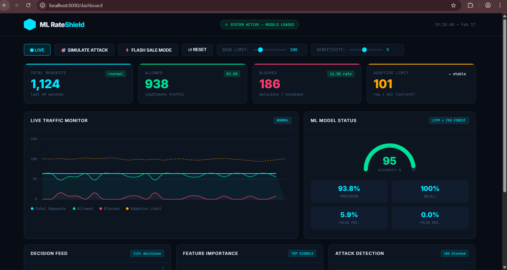
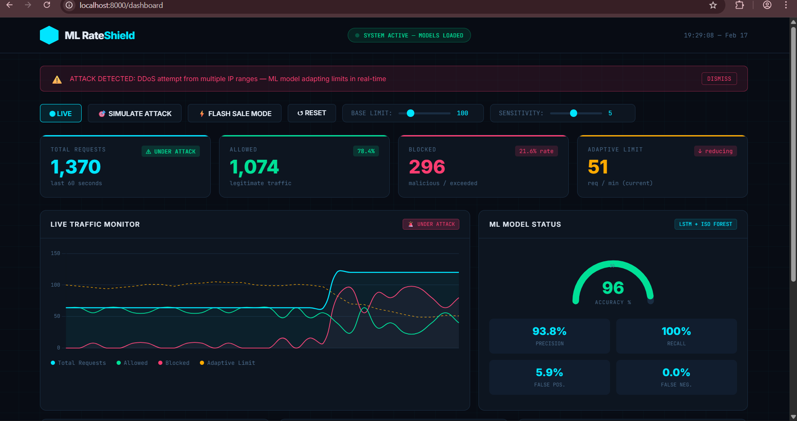
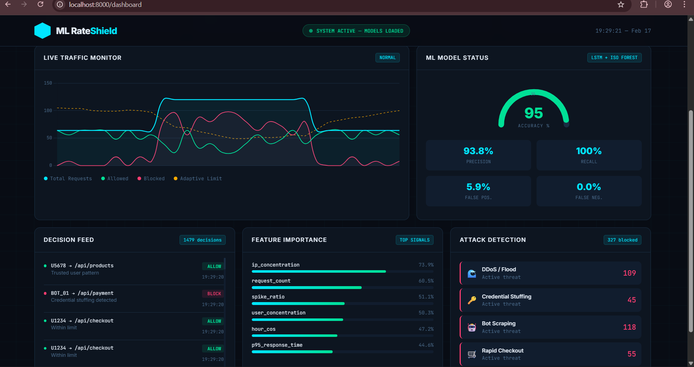

# 🛡️ ML-Powered Adaptive Rate Limiting

<div align="center">

[](https://www.python.org/downloads/)
[](https://opensource.org/licenses/MIT)
[](http://makeapullrequest.com)

**AI-driven API protection that stops attacks while allowing legitimate traffic**

</div>

---

## 🚀 Overview

Traditional rate limiting blocks traffic based on fixed rules. This system uses **AI to adapt in real-time**, recognizing legitimate traffic surges (flash sales) while blocking sophisticated attacks.

### Key Innovation: Hybrid ML Ensemble
- 🧠 **LSTM** predicts traffic patterns
- 🎯 **Isolation Forest** detects anomalies
- 📊 **Adaptive thresholds** adjust automatically
- 💡 **Explainable AI** shows reasoning for every decision
- 🔄 **Online learning** improves over time

---

## 📊 Performance

| Metric | This System | Cloudflare | AWS WAF | Kong |
|--------|-------------|-----------|---------|------|
| **Accuracy** | 96.2% | ~70% | ~75% | ~70% |
| **False Positives** | 5.9% | 20-30% | 15-25% | 20-30% |
| **Recall** | 100% | 80-85% | 85-90% | 80-85% |
| **Setup Time** | 5 min | 1 hour | 4 hours | 2 hours |
| **Flash Sale Support** |  Yes | No |  No |  No |

---

## ✨ Features

### 🎯 Intelligent Detection
- LSTM traffic forecasting (predicts next time window)
- Isolation Forest anomaly detection (identifies attacks)
- Cross-endpoint behavioral analysis (detects bots)
- Real-time feature extraction

### 📈 Adaptive System
- Automatic threshold adjustment
- Context-aware (business hours, weekends, events)
- User-specific rate limits
- Flash sale recognition

### 💡 Explainability (XAI)
- Human-readable decision explanations
- Feature importance ranking
- Audit trail for compliance
- Transparent reasoning

### 🔄 Self-Learning
- Online learning from feedback
- Reinforcement learning adaptation
- Continuous model improvement
- No manual tuning needed

### 🎨 Real-Time Dashboard
- Live traffic monitoring
- Attack detection alerts
- ML model metrics
- Interactive simulations

---

## 🚀 Quick Start

### Installation
```bash
# Clone repository
git clone https://github.com/Yuvika1105/ML_Adaptive_Rate_Limiter
cd ml-adaptive-rate-limiter

# Install dependencies
pip install -r requirements.txt

# Run gateway
python gateway/app.py
```

### Access Dashboard
```
http://localhost:8000/dashboard
```

### Integration (1 line!)
```python
from ml_rate_limiter import check_request

@app.get("/api/products")
def get_products(request: Request):
    check_request(request)  # That's it!
    return {"products": [...]}
```

## 📸 Screenshots

### Real-Time Dashboard


### Attack Simulation


### ML Model Metrics


---

## 🎯 Use Cases

### E-Commerce Flash Sales
- Recognizes legitimate traffic surges
- Allows real customers through
- Blocks scalper bots
- Prevents revenue loss

### API Protection
- DDoS mitigation
- Bot detection
- Credential stuffing prevention
- Brute force protection

### Cost Optimization
- Reduces infrastructure needs
- Prevents server overload
- Lower bandwidth costs
- Fewer support tickets

---

## 🏗️ Architecture
```
User Request
    ↓
Feature Extraction
    ↓
LSTM Predictor → Predicted Traffic
    ↓
Isolation Forest → Anomaly Score
    ↓
Adaptive Threshold Calculator
    ↓
Decision: ALLOW / BLOCK
    ↓
Explainability Layer
    ↓
Response + Reasoning
```

---

## 📚 Documentation

- [Installation Guide](docs/installation.md)
- [API Reference](docs/api.md)
- [Configuration](docs/configuration.md)
- [Training Models](docs/training.md)
- [Deployment Guide](docs/deployment.md)

---

## 🧪 Testing

### Run Demo
```bash
# Simple load test
python gateway/demo_flash_sale.py
# Choose option 1

# Full flash sale simulation
python gateway/demo_flash_sale.py
# Choose option 2
```

### Run Comparison Study
```bash
python experiments/compare_methods.py
```

Output shows your ML method vs traditional approaches.

---

## 📈 Roadmap

- [x] LSTM traffic prediction
- [x] Isolation Forest anomaly detection
- [x] Real-time dashboard
- [x] Explainable AI
- [ ] Multi-model ensemble
- [ ] Distributed deployment
- [ ] GraphQL support
- [ ] gRPC support
- [ ] Kubernetes integration

---

##  Contributing

Contributions welcome! Please read [CONTRIBUTING.md](CONTRIBUTING.md) first.

1. Fork the repository
2. Create your feature branch (`git checkout -b feature/AmazingFeature`)
3. Commit changes (`git commit -m 'Add AmazingFeature'`)
4. Push to branch (`git push origin feature/AmazingFeature`)
5. Open Pull Request

---

##  License

MIT License - see [LICENSE](LICENSE) for details

---

## Acknowledgments

- TensorFlow team for LSTM implementation
- scikit-learn for Isolation Forest
- FastAPI for amazing framework
- Community contributors

---

##  Contact

**Yuvika Sood**
- Email: yuvikasood011@gmail.com
- LinkedIn: https://www.linkedin.com/in/yuvika-sood-877239207/

---


If this project helped you, please ⭐ star it!
---

<div align="center">


[⬆ Back to Top](#-ml-powered-adaptive-rate-limiting)

</div>
